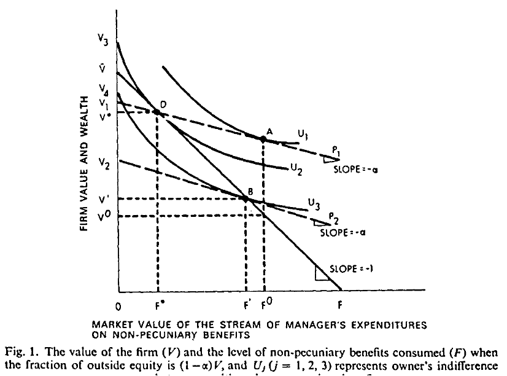
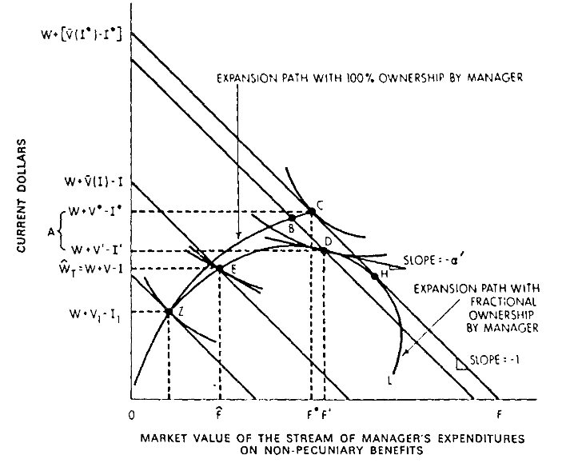
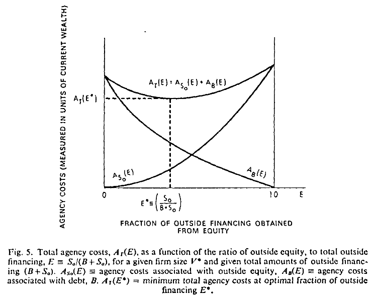

```{r setup, include=FALSE}
knitr::opts_chunk$set(echo = FALSE)
```

## Introduction

+ Before Jensen-Meckling, agency was not a topic broadly considered in theory of firm literature

+ Other Economic models considered

+ Where agency was considered, it was a normative project (prescriptive and not descriptive)

## Agency Costs

+ Relationship as a contract to delegate from one person (principal) to another person (agent) decision making authority

+ Both principle and agent are utility maximizers, so interests will not always align (i.e., agent does not act in best interest of principal who gave him authority)

The cost to align these interests and create incentives for agent define _agency costs_:

(1) Monitoring expenditures by principal
(2) Bonding expenditures by agent
(3) Residual Loss

## Big Idea

+ Incentives of manager can greatly change depending on if he is the sole owner or issues outside equity

+ The manager seeks to maximize his utility, constrained by the trade-offs competing goods of firm-value and "perquisites" or perks

+ Giving up firm ownership through issuance of equity drive a wedge between share holders who want to maximize firm value and the manager who desires to maximize both his stake and his own perks

+ Financing with debt allows manager to retain greater ownership, but also creates incentives for manager to invest in risky projects at expense of bondholders

+ Agency costs of debt (_covered last week_)


## Agency Costs and Outside Equity

+ Assume one period of time (no dynamic modeling) and one "owner-manager"
+ When a manager owns 100% of firm, he has a dollar-for-dollar trade-off of firm value and perks
+ Sells some portion $(1-\alpha)$ of firm, retains $\alpha$, then, trading off firm value for perks is only $\alpha < 1$
+ Then, he can maximize his utility with perks included at the expense of other equity holders
+ Potential Buyers of equity should, under rational expectations, should be aware that the manager may not act in their best interest in this way - purchase price of shares should reflect this:

_Theorem: For a claim on the firm of $(1-\alpha)$ the outsider will pay only $(1-\alpha)$ times the value he expects the firm to have given the induced change in the firm behavior_

## Agency Costs and Outside Equity

_Theorem: For a claim on the firm of $(1-\alpha)$ the outsider will pay only $(1-\alpha)$ times the value he expects the firm to have given the induced change in the firm behavior_

If owner who sells $(1- \alpha)$ of the firm takes less than the optimal "equilibrium" non-pecuniary benefits, then he is making an irrational decision since he sold the $(1- \alpha)$ share for less than he could have. 

+ $(1- \alpha) V' > S_0$ where S_0 is price of $(1-\alpha) V'$ sold to outside owner


Similarly, if he consumes more than the optimal amount of non-pecuniary benefits, it devalues the firm and the outside owner paid more than what the firm is worth. 

+ $(1 - \alpha) V(F, \alpha) < S_0 = (1 - \alpha) V'$ where $V(F, \alpha)$ is value of non-pecuniary benefits consumed

## Agency Costs and Outside Equity




## Agency Costs and Outside Equity

+ Outsiders will not pay their share of the full value of the firm since the manager can potentially lower the value of the firm for his gain on perks

+ Then, outsiders will pay for a smaller value, factoring in the perks the manager will claim

+ Consequently, the decline in total value of the firm from its original amount to what the outside equity holders paid for it will be imposed by the manager


## Agency Costs, Equity, and Determining Optimal Scale


+ In a similar demonstration, Jensen and Meckling show that wealth is lost through agency costs when investment is considered as well. 

+ For the sole owner-manager, there will be an optimal point which maximizes his utility considering both value of the firm and non-pecuniary benefits. 

+ Outside financing incurs agency costs as the owner-manager seeks maximize both firm value and consumption of non-pecuniary benefits. 

+ _Thus the manager stops increasing the size of the firm when the gross increment in value is just offset by the incremental "loss" involved in the consumption of additonal fringe benefits due to his declining fractional interest in the firm._


## Agency Costs, Equity, and Determining Optimal Scale





## Monitoring and Bonding

(1) Monitoring: Firm's outside owners could monitor manager activities, forcing him to give up some use of non-pecuniary benefits through a contract. 
    + Owner manager will do so only if the increase in value of the firm is better for him than the forgone benefits
    + Less benefits mean more firm value less the montoring costs
    + Owner bears cost as wealth reduction
    
(2) Bonding: Manager-owner can spend resources to guarantee to outsiders that he would limit his costly activities
    + Manager will only do it for same reason as accepting monitoring costs and would be same loss


When investment is considered, the story is the same: manager will give up rights if he desires, and the value of the firm will be the equilibrium value less the investment and monitoring/bonding costs. 

## In short

+ As manager gives up ownership, his incentives and those of outsider owners change
+ He will still seek to partake of non-pecuniary benefits which results in lost value of the firm
+ To curb this, outsiders will pay less, or they will ensure monitoring or accept bonding activities
+ In either case, such losses are unavoidable and borne by the decision maker (owner-manager))
+ Then, owner-manager will only do it if the pros outweight the cons

Next, look at debt

## Debt

No firm has 100% debt in reality because:

(1) Incentives of manager
(2) Cost of monitoring incentives
(3) Bankruptcy costs

Debt is still optimal for manager even if no tax benefit due to incentives alone
Saw numerical example in previous class

Like the equity case, there will still be monitoring and bonding costs associated with debt


## Theory of the Corporate Ownership Structure

Assume: 

(1) Assume efficient capital markets and prices of debt and outside equity reflect monitoring costs. 
(2) Owner-manager bears these costs

Then:

_From the owner-manager's standpoint the optimal proportion of outside funds to be obtained from equity (versus debt) for a given level of internal equity is that [optimal fraction of equity to debt plus equity] which results in minimum total agency costs._ 


## Theory of the Corporate Ownership Structure

+ Total Agency costs comes from agency cost of equity and debt combined
+ Agency costs of debt are at their highest when firm is financed 100% with debt
+ Agency costs of equity are at their highest when firm is financed with all outside equity
+ Reducing debt lowers agency costs of debt, and reducing equity lowers agency costs of equity
+ Then, there must be an optimal level which minimizes agency costs for owner-manager. 


## Theory of the Corporate Ownership Structure




